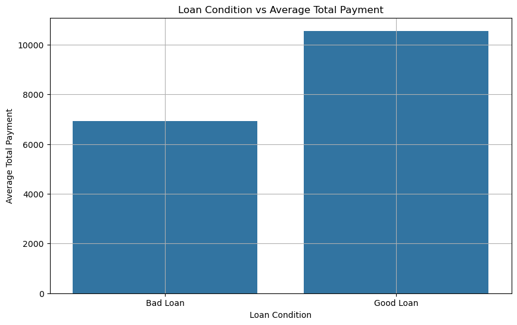

# Mortgage Risk Assessment Project

## Project Overview

Welcome to the **Mortgage Risk Assessment Project**! Our project focuses on analyzing and predicting mortgage loan amounts and assessing loan conditions (Good Loan vs. Bad Loan) using various machine learning techniques. Our team has designed, implemented, and tested regression and classification models to gain insights into the factors affecting loan amounts and conditions.

---

## Team Members

- **Doga Gizem** ([dogagzm](https://github.com/dogagzm))
- **Jinrong Liu** ([liujinro](https://github.com/liujinro))
- **Krishna Kishore** ([krishnakishore163](https://github.com/krishnakishore163))
- **Kristina Talalaievska** ([KristinaTalalaievska](https://github.com/KristinaTalalaievska))
- **Oleg Movchaniuk** ([movcha](https://github.com/movcha))

---

## Visualizations

### **Graphy.py - Doga Memis**

<p>
  
  
  
  
    
</p>

**Analysis of Mortgage Loan Data**

- **Objective:** To examine key factors related to mortgage loans, such as loan amounts, interest rates, income, debt-to-income ratios, and loan conditions.

- **Visualizations:**
  - **Scatter Plots:** To observe relationships like loan amount vs. interest rate.
  - **Box Plots and Bar Plots:** To compare metrics like total payments by loan condition and the impact of loan grade on interest rates.

#### **Audience:**

- Financial Analysts, Mortgage Lenders, and Data Scientists.

<br>

---

### **Project2_Jinrong.ipynb**


#### **Topic:**  
Analyzing the impact of loan conditions (Good Loan vs. Bad Loan) on total payment and loan amounts over time.

- **Objective:** To visualize the relationship between the loan amount and total payment over the years, differentiated by loan conditions. The goal is to track trends and observe how loan amounts and payments have evolved over time.
- **Insights:** By analyzing bar heights and trend lines, we can determine whether there's an increase in good or bad loans over the years, indicating changes in lending criteria or economic conditions.

#### **Audience:**

- Financial Analysts and Stakeholders who need to see the loan trends year by year.

#### **Visualization:**

- **Bar Charts with Trend Lines:** Effective for comparing different categories (Good vs. Bad Loans) over time and identifying long-term trends.

#### **Frameworks:**

- **Matplotlib:** Used for flexibility and customization, essential for handling complex financial data.

<br>

---

### **App.ipynb**

#### **Detailed Interpretation of Risk Profile Dashboard**

  Developed using Python with Dash by Plotly, this dashboard offers interactive elements like filters and sliders to help users explore various aspects of loan conditions.


- **Income vs. Loan Amount**  
  - **Observations:** Loan amounts vary with annual income; higher incomes are often associated with larger loan amounts.
  - **Insights:** Higher-income individuals tend to have good loan conditions even with large loan amounts, suggesting that income is a strong predictor of loan quality.

- **Loan Condition Distribution**  
  - **Observations:** Visualized through different colors representing loan conditions, allowing for the analysis of which income groups or loan amounts have higher rates of bad loans.
  - **Insights:** Bad loans are concentrated in certain income brackets or loan amounts, indicating risky segments that require closer monitoring.

- **Filtering Effects**  
  - **Income Category Filter:** Filters by income brackets to analyze how loan conditions change across different income levels.
  - **Home Ownership Filter:** Displays loan conditions based on home ownership status, such as a higher rate of bad loans in rented homes.
  - **Loan Term Filter:** Demonstrates variations in loan conditions across different loan durations.

#### **Correlation Matrix Heatmap Analysis**

 A powerful visualization tool to show relationships between different variables and their influence on loan conditions.


- **Key Observations:**
  - **Interest Rate:** High negative correlation with loan_condition_encoded.
  - **DTI (Debt-to-Income Ratio) or Loan Amount:** Strongly correlated with bad loan conditions.
  
By visualizing the correlation matrix heatmap, we gain a clearer understanding of how different variables interact and their influence on loan conditions — essential for effective risk management and improving predictive models.

---

### **Final Team Project - Kristina Talalaievska**


- **Visualization #1 in Tableau:**  
  Analyzing trends from 2006 to 2016 to show growing confidence in the lending market.  
  [View Visualization](https://public.tableau.com/views/Mortgagemarketinvestigation/Sheet1?:language=en-US&:sid=&:redirect=auth&:display_count=n&:origin=viz_share_link)

- **Objective:**  
  To provide a data-driven understanding of the lending market’s evolution, focusing on factors that contributed to increased confidence among lenders and borrowers.

#### **Design:**

- **Interactive Dashboard:** Allows users to drill down into specific years, regions, or data points, presenting complex data in an accessible format.


- **Visualization #2 in Tableau:**  

  Identifying regions with higher loan amounts and correlating them with economic growth.  
  [View Visualization](https://public.tableau.com/app/profile/kristina.talalaievska/viz/Identifyingregionshigheronloanamountsandshowingmoreeconomicgrowth/Sheet2)

#### **Analysis:**

- **Regional Loan Distribution and Economic Growth Correlation:**  
  Analyzes how loan amounts correlate with economic growth indicators like GDP and employment rates.

<br>

---

### **Interest Rate by Loan Grade - Oleg Movchaniuk**


The provided visualization displays the relationship between loan grades and interest rates, separated by loan conditions ("Good Loan" and "Bad Loan"). Here’s how the visualization was created and the insights it offers:

### **Steps to Create the Visualization:**
1. **Loading the Dataset:**
   - The dataset `mortgage.csv` was loaded using Pandas. This dataset includes information such as `grade`, `interest_rate`, and `loan_condition`.

2. **Categorizing Loan Grades:**
   - The `grade` column, which represents the loan grade (A to G), was explicitly set as a categorical variable with a specified order from 'A' to 'G'.

3. **Identifying Bad Loans:**
   - A `bad_loan` column was created, where loans categorized as 'Bad Loan' in the `loan_condition` column were flagged as True.

4. **Calculating Bad Loan Percentages:**
   - The percentage of bad loans within each grade was calculated. This is the ratio of bad loans to the total number of loans in each grade, multiplied by 100.

5. **Creating the Bar Plot:**
   - The bar plot was created using Plotly Express. The x-axis represents the loan grades (A to G), and the y-axis represents the interest rate. The bars are color-coded by the loan condition ('Good Loan' in blue and 'Bad Loan' in red). The `barmode='group'` argument was used to group the bars by loan condition within each grade.

6. **Annotating Bad Loan Percentages:**
   - Annotations were added to display the percentage of bad loans for each grade. The annotation text is positioned slightly above the midpoint of the bad loan bar for each grade.

### **Results & Insights:**
- **Interest Rates:**
  - Interest rates generally increase as the loan grade decreases (from A to G). This trend is expected, as lower-grade loans are riskier, leading to higher interest rates.
  
- **Bad Loan Percentages:**
  - The percentage of bad loans increases with the grade, with Grade A having the lowest percentage (4.7%) and Grade G having the highest percentage (22.2%). This indicates that lower-grade loans not only have higher interest rates but are also more likely to default.

- **Loan Condition:**
  - The proportion of bad loans is visibly higher in the lower grades, which is highlighted by the increasing size of the red bars as we move from grade A to G.

This visualization effectively communicates the relationship between loan grade, interest rate, and loan condition, showing that both interest rates and the likelihood of a loan being classified as "Bad" increase as the loan grade decreases.

[This and others Visuals from Oleg Movchaniuk](https://github.com/movcha/team_project/blob/main/4_visuals_from_movcha.ipynb)

<br>

---

## Rules of Engagement

1. Transparent and clear communication among team members.
2. Collaboration and teamwork.
3. Respect and professionalism in sharing different viewpoints.
4. Leveraging each team member's expertise for effective project contributions.
5. Conducting regular team meetings and summarizing key discussion points.
6. Open idea-sharing.
7. Providing support for team members facing difficulties.
8. Commitment to continuous improvement.

---

## Video Links

- [Doga Memis](https://drive.google.com/file/d/1fSrtiI2qsf8S9FBjv8rG0reGXyvNAIt-/view?usp=drive_link)
- [Jinrong Liu](https://vimeo.com/1000558863/d0e722b4f2?share=copy)
- [Krishna Kishore](https://vimeo.com/1000959222/4afd8dce93?share=copy)
- [Kristina Talalaievska](https://drive.google.com/file/d/1hgNK0Y32LRxVpXNiHaegi-lkWQNTQ1SH/view?usp=share_link)
- [Oleg Movchaniuk](https://drive.google.com/file/d/1hgNK0Y32LRxVpXNiHaegi-lkWQNTQ1SH/view?usp=share_link)

## Sources and references utilized for this project 
  - [Data folder](./data/)
  - [Source Code](./src/)

<br>

---

<details>
<summary>Team Project 1</summary>

# Mortgage Risk Assessment Project (Team Project 1)

## Project Overview

Welcome to the Mortgage Risk Assessment Project! This project aims to analyze and predict mortgage loan amounts and assess loan conditions (Good Loan vs. Bad Loan) using various machine learning techniques. Our team has designed, implemented, and tested regression and classification models to gain insights into the factors affecting loan amounts and conditions.

## Team Members

- **Doga Gizem (dogagzm)**
- **Krishna Kishore (krishnakishore163)**
- **Oleg Movchaniuk (movcha)**
- **Shiyam Hoda (shiyamhoda)**

## Project Structure

The project is divided into several parts:
1. **Linear Regression Analysis**: Predicting loan amounts based on features such as annual income, employment length, interest rate, debt-to-income ratio, and grade category.
2. **Logistic Regression Analysis**: Classifying loans as 'Good' or 'Bad' based on the same set of features.
3. **Random Forest Classifier**: Improving loan condition classification using a Random Forest classifier.

**Design:**
- **Features:** `annual_inc`, `emp_length_int`, `interest_rate`, `dti`, `grade_cat`
- **Target:** `loan_amount`

**Findings:**
Impact of Borrower Characteristics on Mortgage Risk
Regression Analysis
- **Linear Regression**: Identified key borrower characteristics such as annual income, employment length, interest rate, debt-to-income ratio, and credit grade significantly influencing loan amounts.
- **Logistic Regression**: Highlighted significant predictors of loan condition, confirming the importance of borrower characteristics in determining mortgage risks.
- **Random Forest Classifier**: Provided robust classification of loan conditions, reinforcing findings from regression analyses.

**Conclusion:**
This project provides comprehensive insights into how borrower characteristics influence mortgage risks. By analyzing diverse datasets and employing robust methodologies, the findings offer valuable guidance for policymakers, lenders, and borrowers, aiding in informed decision-making and risk management.

**Next Steps:**
Future work may include:

- Incorporating additional economic indicators.
- Enhancing model performance with advanced techniques.
- Deploying models for real-time risk assessment.

## Progress Report

### 2024-06-17
- Group chat in Slack was created before the Team Project pt.I day 1, thanks Shiyam
- Established a constant point of contact
- Initiated thinking about the project topic

### 2024-06-18
**On a Meeting:**
- First team meeting getting to know each other
- Shared background of team members
- Decided on a project topic direction: mortgages and mortgage risk assessment
- All team members agreed to look through the given datasets list for data connected with mortgages, loans, interest rates, house prices, and so on

**Independent Work:**
- Each team member explored the datasets list for relevant data

### 2024-06-19
- From the options proposed by each team member, one dataset was selected
- Cleaned data by removing irrelevant column attributes and sampling data on certain dates to reduce the overall file size so that it can be uploaded to GitHub

### 2024-06-20 - 2024-06-30
- Main work on the project algorithm
- Linear Regression Analysis
- Logistic Regression Analysis
- Random Forest Classifier

### 2024-06-30
- Finalizing the project
- Creating a README file
- Recording a video

### 2024-07-07
- Minor changes README file
- Adding video links

- Sources and references utilized for this project can be accessed in:
  - [Data folder](./data/)
  - [Source Code and Models](./src/)


 ## Links to individual videos

- [Doga Gizem (dogagzy)](https://drive.google.com/drive/folders/1FTX5VDLg291xYiZbtpJVIrgAJx0B96Xx)
- [Oleg Movchaniuk (movcha)](https://drive.google.com/file/d/1DT6D9mUT1SC1jm6RPYv5Sqi7qwigCxfm)

</details>

---

<details>
<summary>Original Team Project Requirements</summary>

## Description
The team project consists of two modules. Each module requires participants to apply the skills they have learned to date, and explore a dataset of their choosing. The first part of the team project involves creating a simple program with a database in order to analyze a dataset from an open source, such as Kaggle. In the second part of the team project, teams will come together again and apply the skills developed in each of the data science or machine learning foundations certificate streams. Teams will either create a data visualization or a machine learning model.

Participants will work in assigned teams of 4-5. 

#### Project Descriptions

* [First Team Project Description](./team_project_1.md)
* [Second Team Project Description](./team_project_2.md)

## Learning Outcomes
By the end of Team Project Module 1, participants will be able to:
* Resolve merge conflicts
* Describe common problems or challenges a team encounters when working collaboratively using Git and GitHub
* Create a program to analyze a dataset with contributions from multiple team members

By the end of Team Project Module 2, participants will be able to:
* Create a data visualization as a team
* Create a machine learning model as a team

### Contacts
**Questions can be submitted to the _#cohort-3-help_ channel on Slack**

* Technical Facilitator: 
  * **Kamilah Ebrahim**(she/her)
  kamilah.ebrahim@mail.utoronto.ca

* Learning Support Staff:

  * **Farzaneh Hashemi** (she/her )
  fhashemi.ma@gmail.com
  * **Tong Su** (she/her)
  tong.su@mail.utoronto.ca

### Delivery of Team Project Modules

Each Team Project module will include two live learning sessions and one case study presentation. During live learning sessions, facilitators will introduce the project, walk through relevant examples, and introduce various team skills that support project success. The remaining time will be used for teams to assemble and work on their projects, as well as get help from the facilitator or the learning support to troubleshoot any issues a team may be encountering. 

Work periods will also be used as opportunities for teams to collaborate and work together, while accessing learning support. 

### Schedule

|Day 1|Day 2|Day 3|Day 4|Day 5|
|-----|-----|-----|-----|-----|
|Live Learning Session |Live Learning Session|Case Study|Work Period|Work Period|

## Requirements
* Participants are expected to attend live learning sessions and the case study as part of the learning experience. Participants are encouraged to use the scheduled work period time to complete their projects.
* Participants are encouraged to ask questions and collaborate with others to enhance learning.
* Participants must have a computer and an internet connection to participate in online activities.
* Participants must not use generative AI such as ChatGPT to generate code to complete assignments. It should be used as a supportive tool to seek out answers to questions you may have.
* We expect participants to have completed the [onboarding repo](https://github.com/UofT-DSI/onboarding/tree/main/onboarding_documents).
* We encourage participants to default to having their camera on at all times, and turning the camera off only as needed. This will greatly enhance the learning experience for all participants and provides real-time feedback for the instructional team. 

### How to get help


## Folder Structure

### Project 1
```markdown
|-- data
|---- processed
|---- raw
|---- sql
|-- reports
|-- src
|-- README.md
|-- .gitignore
```

### Project 2
```markdown
|-- data
|---- processed
|---- raw
|---- sql
|-- experiments
|-- models
|-- reports
|-- src
|-- README.md
|-- .gitignore
```

* **Data:** Contains the raw, processed and final data. For any data living in a database, make sure to export the tables out into the `sql` folder, so it can be used by anyone else.
* **Experiments:** A folder for experiments
* **Models:** A folder containing trained models or model predictions
* **Reports:** Generated HTML, PDF etc. of your report
* **src:** Project source code
* README: This file!
* .gitignore: Files to exclude from this folder, specified by the Technical Facilitator

</details>

---
